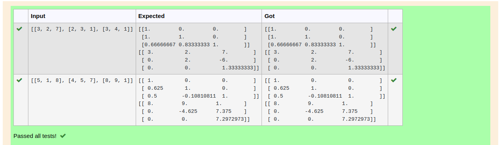
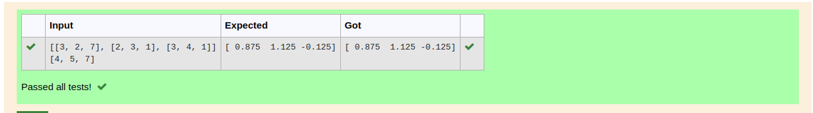

# LU Decomposition 

## AIM:
To write a program to find the LU Decomposition of a matrix.

## Equipments Required:
1. Hardware – PCs
2. Anaconda – Python 3.7 Installation / Moodle-Code Runner

## Algorithm
1. import numpy,scipy.linalg python library as n,lu

2. Get input from user as x

3. convert x into array

4. lu() returns three values assign it as p,l,u

5. Then print l matrix and u matrix 

## Program:
(i) To find the L and U matrix
```
Program to find the L and U matrix.
Developed by: nivetha.a
RegisterNumber: 22003573
```
import numpy as np

from scipy.linalg import lu

A=np.array(eval(input()))

P,L,U=lu(A)

print(L)

print(U)

(ii) To find the LU Decomposition of a matrix
```
Program to find the LU Decomposition of a matrix.
Developed by: nivetha.a
RegisterNumber: 22003573
```
import numpy as np

from scipy.linalg import lu_factor,lu_solve

A=np.array(eval(input()))

B=np.array(eval(input()))

lu,piv=lu_factor(A)

x=lu_solve((lu,piv),B)

print(x)

## Output:

(i) To find the L and U matrix



(ii) To find the LU Decomposition of a matrix




## Result:
Thus the program to find the LU Decomposition of a matrix is written and verified using python programming.

